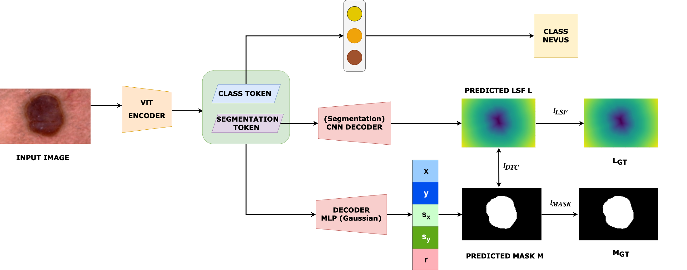

# GS-TransUNet (SPIE Medical Imaging '25)🩺✨
## *Integrated 2D Gaussian Splatting and Transformer UNet for Accurate Skin Lesion Analysis*

<div align="center">

[](https://arxiv.org/abs/2502.16748)
[](https://github.com/AnandK27/GS-TransUNet)

</div>

---

<div align="center">
<h4>👨‍⚕️ Authors</h4>

[Anand Kumar](https://github.com/AnandK27) • Kavinder Roghit Kanthen • Josna John
</div>

---

## 📄 Abstract

<div align="justify">

This research aims to develop a **more effective and accurate** automated diagnostic tool for skin cancer analysis by simultaneously addressing **lesion segmentation and classification tasks**. Traditional methods typically handle these tasks separately, which can lead to inefficiencies and reduced accuracy. 

The **GS-TransUNet model** aims to integrate these tasks into a cohesive framework, leveraging advanced machine learning techniques to improve diagnostic precision and speed.

By combining **2D Gaussian Splatting** with **Transformer UNet architecture**, this study seeks to enhance the consistency and accuracy of segmentation masks, which are crucial for the reliable classification of skin lesions. This integrated approach improves diagnostic accuracy and reduces the computational cost associated with separate processing stages, paving the way for **real-time applications in clinical settings**.

</div>

## 🚀 Quick Start
### 🔧 1. Download Google Pre-trained ViT Models

Get the pre-trained Vision Transformer models from Google:

- **Available Models**: `R50-ViT-B_16`, `ViT-B_16`, `ViT-L_16`
- **Source**: [Google Cloud Storage - ViT Models](https://console.cloud.google.com/storage/vit_models/)

```bash
# Download and setup ViT model
wget https://storage.googleapis.com/vit_models/imagenet21k/{MODEL_NAME}.npz
mkdir -p ../model/vit_checkpoint/imagenet21k
mv {MODEL_NAME}.npz ../model/vit_checkpoint/imagenet21k/{MODEL_NAME}.npz
```

### 📊 2. Prepare Datasets

<details>
<summary><strong>📁 Required Datasets</strong></summary>

1. **ISIC-2017 Dataset**
   - 📥 [Download ISIC-2017](https://challenge.isic-archive.com/landing/2017/)
   - 🔬 Comprehensive skin lesion dataset

2. **PH-2 Dataset** 
   - 📥 [Download PH-2](https://www.dropbox.com/s/k88qukc20ljnbuo/PH2Dataset.rar)
   - 🏥 Dermoscopy image database

</details>

> ⚠️ **Important**: Update the root paths in [`dataset.py`](https://github.com/AnandK27/GS-TransUNet/blob/dsmlp_gauss/dataset.py) to match your local setup.

### 🐍 3. Environment Setup

<details>
<summary><strong>🛠️ Installation Steps</strong></summary>

1. **Python Environment**
   ```bash
   # Requires Python 3.7+
   python --version
   ```

2. **Install Dependencies**
   ```bash
   pip install -r model/requirements.txt
   ```

</details>

### 🎯 4. Training & Testing

**🚀 Start Training**

```bash
# Run training with GPU acceleration
CUDA_VISIBLE_DEVICES=0 python train.py --xp_name gauss
```

> 🔄 **Note**: The script automatically runs testing after training completion.

---

## 📈 Model Architecture




</div>

## 🎯 Key Features

<div align="center">

| Feature | Description |
|---------|-------------|
| 🔬 **Dual Task Learning** | Simultaneous segmentation and classification |
| ⚡ **2D Gaussian Splatting** | Enhanced feature representation |
| 🤖 **Transformer UNet** | Advanced attention mechanisms |
| 🚀 **Real-time Inference** | Optimized for clinical deployment |
| 📊 **SOTA Performance** | State-of-the-art accuracy on medical datasets |

</div>

---

## 📚 Citation

If you find our work helpful in your research, please consider citing:

<details>
<summary><strong>📋 BibTeX Citation</strong></summary>

```bibtex
@inproceedings{kumar2024gstransunet,
  author    = {Kumar, Anand and Kavinder Roghit, Kanthen and John, Josna},
  booktitle = {Medical Imaging 2025: AI/ML},
  organization = {SPIE},
  title     = {GS-TransUNet: integrated 2D Gaussian splatting and transformer UNet for accurate skin lesion analysis},
  month     = nov,
  year      = {2024},
  doi       = {10.1117/12.3046869}
}
```

</details>

---

## 🙏 Acknowledgments

<div align="center">

**Built upon:**

[](https://arxiv.org/pdf/2102.04306)
[](https://github.com/google-research/vision_transformer)
[](https://github.com/jeonsworld/ViT-pytorch)
[](https://github.com/qubvel/segmentation_models.pytorch)

</div>

---
